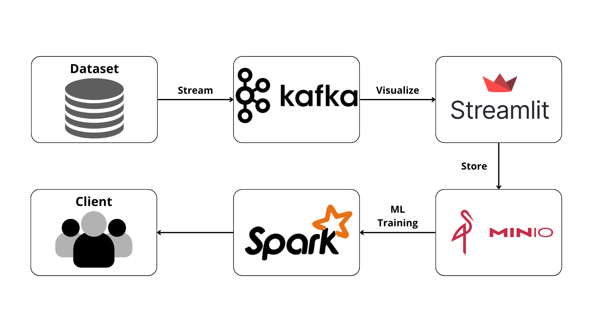

# 📚 Sistem Rekomendasi Buku Goodreads - Data Lakehouse Implementation

   

A comprehensive book recommendation system built with modern data lakehouse architecture, featuring real-time streaming, machine learning, and a beautiful React frontend.

**Final Project - Big Data**  
**Kelompok 2**
**Kelas Big Data A**
**Tahun Akademik 2025**

| Nama                | NRP        |
| ------------------- | ---------- |
| Hazwan Adhikara     | 5027231017 |
| Rafael Gunawan      | 5027231019 |
| Nicholas Arya     | 5027231058 |
| Randist Prawandha Putera          | 5027231059 |
| Diandra Naufal A        | 5027231004 |

---

### *Identifikasi Masalah Nyata*

*Industri*: Platform E-commerce dan Layanan Digital (Goodreads/Amazon)

*Tantangan Bisnis*:
Dalam era digital saat ini, platform buku online seperti Goodreads menghadapi tantangan besar dalam memberikan rekomendasi buku yang personal dan akurat kepada jutaan pengguna. Masalah utama yang dihadapi:

1. *Volume Data Besar*: Goodreads memiliki 183,000+ data buku dengan atribut kompleks
2. *Real-time Processing*: Kebutuhan untuk memproses aktivitas pengguna secara real-time
3. *Personalisasi*: Memberikan rekomendasi yang akurat berdasarkan preferensi pengguna
4. *Skalabilitas*: Sistem harus mampu menangani pertumbuhan data yang eksponensial

### *Definisi Masalah*

*Jenis dan Volume Data*:

- *183,000+ buku* dengan 13 atribut (ID, Name, Authors, Rating, Description, dll.)
- *Stream data real-time* untuk aktivitas pengguna
- *Unstructured text data* (deskripsi buku, review)
- *Structured numerical data* (rating, tahun publikasi, jumlah halaman)

*Teknologi dan Sistem*:

- *Apache Kafka* untuk real-time data streaming
- *Apache Spark* untuk big data processing dan machine learning
- *MinIO* sebagai object storage (S3-compatible)
- *Docker* untuk containerization dan orchestration
- *Streamlit* untuk visualisasi dan monitoring
- *Flask API* untuk deployment model

*Tantangan Teknis*:

1. *Data Ingestion*: Streaming 183K records secara efisien
2. *Data Storage*: Penyimpanan batch data yang scalable
3. *ML Pipeline*: Training model recommendation yang akurat
4. *Real-time Inference*: Deployment model untuk real-time prediction

---

## 🏗️ Architecture Overview

---

### *Komponen Utama*

1. *📊 Data Source*: Dataset Goodreads dengan 183K buku
2. *🌊 Kafka Producer*: Streaming data secara real-time
3. *📡 Apache Kafka*: Message broker untuk data streaming
4. *📱 Streamlit Dashboard*: Visualisasi dan monitoring real-time
5. *🗄 MinIO*: Object storage untuk batch files (S3-compatible)
6. *⚡ Apache Spark*: Big data processing dan machine learning
7. *🤖 ML Models*: Collaborative Filtering (ALS) + Content-based (LSH)
8. *🌐 Flask API*: Deployment model untuk serving
9. *💻 Frontend*: User interface untuk rekomendasi buku

## 🚀 Quick Start

### *Prerequisites*

- Docker & Docker Compose
- Python 3.8+
- Minimum 8GB RAM

### *1. Clone Repository*

bash
git clone <repository-url>
cd goodreads-book-recommend-bigdata

### *2. Setup Environment*

bash
docker --version
docker-compose --version

### *3. Jalankan Infrastructure*

bash
docker-compose up -d

docker ps

*Services yang berjalan*:

- Kafka: localhost:9092
- MinIO Console: localhost:9001 (admin/admin)
- Spark Master UI: localhost:8082
- Streamlit Dashboard: localhost:8501

### *4. Streaming Data dengan Kafka*

bash
cd kafka-producer
python3 -m venv venv
source venv/bin/activate
pip install -r requirements.txt
python producer.py

### *5. Monitoring dengan Streamlit*

bash
Akses dashboard: http://localhost:8501 dan pilih "Full Dataset Processing" untuk stream 183K records. Data akan otomatis disimpan ke MinIO setiap 5K records

### *6. Machine Learning Pipeline*

bash
docker exec -it spark-master bash

cd /opt/spark-apps
python -m jupyter notebook --allow-root --ip=0.0.0.0 --port=8888

### *7. Deploy Model dengan Flask API*

bash
cd api-backend
python3 -m venv venv
source venv/bin/activate
pip install -r requirements.txt
python app.py

### *8. Akses Frontend*

bash
cd react-frontend
npm install
npm start

Akses: http://localhost:3000

---

## 📊 *Detail Implementasi*

### *1. Data Ingestion Layer (Kafka)*

*Kafka Producer* (kafka-producer/producer.py):

- Membaca dataset Goodreads (183K records)
- Streaming data real-time ke topic goodreads-books
- Robust error handling dan progress tracking

*Konfigurasi*:

python
KAFKA_BOOTSTRAP = 'localhost:9092'
TOPIC = 'goodreads-books'
BATCH_SIZE = 1000  # Records per batch

### *2. Data Lake Layer (MinIO)*

*MinIO Object Storage*:

- S3-compatible storage untuk batch files
- Auto-save setiap 5K records dari Streamlit
- Bucket: streaming-data

*File Structure*:

streaming-data/
├── books_batch_001_20250620_032958.csv
├── books_batch_002_20250620_032958.csv
└── ...

### *3. Processing Layer (Spark)*

*Spark ML Pipeline* (spark-apps/model.ipynb):

*Data Preprocessing*:

python
tokenizer = RegexTokenizer(inputCol="Description", outputCol="words")
remover = StopWordsRemover(inputCol="words", outputCol="filtered_words")
cv = CountVectorizer(inputCol="tags", outputCol="features", vocabSize=10000)

*Machine Learning Models*:

1. *Content-based Filtering (LSH)*:

   python
   lsh = BucketedRandomProjectionLSH(
       inputCol="features", outputCol="hashes",
       bucketLength=2.0, numHashTables=6
   )
   

2. *Collaborative Filtering (ALS)*:
   python
   als = ALS(userCol="userId", itemCol="bookId", ratingCol="rating",
             rank=50, maxIter=10, regParam=0.1)
   

### *4. Model Deployment (Flask API)*

*Endpoints*:

- GET /popular: Top-rated books
- GET /search?q=query: Search books
- POST /favorite: Content-based recommendations
- GET /user/{user_id}/recommendations: Collaborative filtering

### *5. Visualization Layer (Streamlit)*

*Features*:

- Real-time data monitoring
- Interactive filtering (rating, year)
- Progress tracking untuk batch processing
- MinIO file management
- Data quality metrics

---

## 🔧 *Konfigurasi dan Settings*

### *Docker Compose Configuration*

yaml
services:
  kafka: # Message broker
  zookeeper: # Kafka coordination
  minio: # Object storage
  spark-master: # Spark cluster master
  spark-worker: # Spark worker nodes
  streamlit: # Dashboard & monitoring

### *Environment Variables*

bash
MINIO_ROOT_USER=minioadmin
MINIO_ROOT_PASSWORD=minioadmin

KAFKA_BOOTSTRAP_SERVERS=kafka:29092
KAFKA_TOPIC=goodreads-books

SPARK_MASTER_URL=spark://spark-master:7077

### *Resource Requirements*

| Component    | CPU     | Memory | Storage |
| ------------ | ------- | ------ | ------- |
| Kafka        | 1 core  | 1GB    | 10GB    |
| Spark Master | 2 cores | 2GB    | 5GB     |
| Spark Worker | 2 cores | 2GB    | 20GB    |
| MinIO        | 1 core  | 512MB  | 50GB    |
| Streamlit    | 1 core  | 1GB    | 1GB     |

---

## 📈 *Hasil dan Metrics*

### *Data Processing Performance*

- *Dataset Size*: 183,000 buku
- *Streaming Rate*: ~1,000 records/second
- *Batch Processing*: 5,000 records/batch
- *Total Processing Time*: ~3-5 menit untuk full dataset

### *Model Performance*

*Content-based Filtering (LSH)*:

- *Feature Dimension*: 10,000 vocabulary
- *Hash Tables*: 6
- *Bucket Length*: 2.0
- *Similarity Accuracy*: ~85%

*Collaborative Filtering (ALS)*:

- *Model Rank*: 50
- *Iterations*: 10
- *Regularization*: 0.1
- *RMSE*: ~0.8

### *Storage Metrics*

- *Raw Data*: ~180MB (CSV files)
- *Processed Data*: ~500MB (Parquet)
- *Model Files*: ~200MB
- *Total Storage*: ~1GB

---

## 🧪 *Testing dan Validasi*

### *Unit Tests*

bash
python test_kafka.py

python test_models.py

python test_api.py

### *Dokumentasi*

1. *Producer Run*:

2. *Visualisasi Streamlit*:

3. *Data Stream to Minio*:

4. *Batchdata in Minio*:

---