# 📚 Sistem Rekomendasi Buku Goodreads - Data Lakehouse Implementation

     

Sebuah sistem rekomendasi buku yang komprehensif dengan arsitektur data lakehouse modern, menampilkan real-time streaming, machine learning.

**Final Project - Big Data**  
**Kelompok 2**  
**Kelas Big Data A**  
**Tahun Akademik 2025**

| Nama                     | NRP        |
| ------------------------ | ---------- |
| Diandra Naufal A         | 5027231004 |
| Hazwan Adhikara          | 5027231017 |
| Rafael Gunawan           | 5027231019 |
| Nicholas Arya            | 5027231058 |
| Randist Prawandha Putera | 5027231059 |

---

## 📖 Daftar Isi

1. [Identifikasi Masalah](#-identifikasi-masalah-nyata)
2. [Arsitektur Sistem](#️-architecture-overview)
3. [Struktur Proyek](#-struktur-proyek)
4. [Quick Start](#-quick-start)
5. [Detail Implementasi](#-detail-implementasi)
6. [Testing & Validasi](#-testing-dan-validasi)
7. [Dokumentasi API](#-dokumentasi-api)
8. [Deployment](#-deployment)
9. [Monitoring & Analytics](#-monitoring--analytics)
10. [Troubleshooting](#-troubleshooting)

---

## 🎯 Identifikasi Masalah Nyata

### _Industri_: Platform E-commerce dan Layanan Digital (Goodreads)

### _Tantangan Bisnis_:

Dalam era digital saat ini, platform buku online seperti Goodreads menghadapi tantangan besar dalam memberikan rekomendasi buku yang personal dan akurat kepada jutaan pengguna. Masalah utama yang dihadapi:

1. **📊 Volume Data Besar**: Goodreads memiliki 183,000+ data buku dengan atribut kompleks
2. **⚡ Real-time Processing**: Kebutuhan untuk memproses aktivitas pengguna secara real-time
3. **🎯 Personalisasi**: Memberikan rekomendasi yang akurat berdasarkan preferensi pengguna
4. **📈 Skalabilitas**: Sistem harus mampu menangani pertumbuhan data yang eksponensial
5. **🔍 Discovery**: Membantu pengguna menemukan buku baru sesuai minat mereka

### _Definisi Masalah_

**Jenis dan Volume Data**:

- **183,000+ buku** dengan 13 atribut (ID, Name, Authors, Rating, Description, dll.)
- **Stream data real-time** untuk aktivitas pengguna
- **Unstructured text data** (deskripsi buku, review)
- **Structured numerical data** (rating, tahun publikasi, jumlah halaman)

**Teknologi dan Sistem**:

- **Apache Kafka** untuk real-time data streaming
- **Apache Spark** untuk big data processing dan machine learning
- **MinIO** sebagai object storage (S3-compatible)
- **Docker** untuk containerization dan orchestration
- **React + TypeScript** untuk modern frontend
- **Flask API** untuk deployment model

**Tantangan Teknis**:

1. **Data Ingestion**: Streaming 183K records secara efisien
2. **Data Storage**: Penyimpanan batch data yang scalable
3. **ML Pipeline**: Training model recommendation yang akurat
4. **Real-time Inference**: Deployment model untuk real-time prediction
5. **User Experience**: Interface yang responsive dan intuitif

---

## 🏗️ Data Flow & Architecture Overview


---

### **Komponen Utama**

| Komponen                   | Deskripsi                                           | Port/URL | Status |
| -------------------------- | --------------------------------------------------- | -------- | ------ |
| 📊 **Data Source**         | Dataset Goodreads dengan 183K buku                  | -        | ✅     |
| 🌊 **Kafka Producer**      | Streaming data secara real-time                     | 9092     | ✅     |
| 📡 **Apache Kafka**        | Message broker untuk data streaming                 | 9092     | ✅     |
| 📱 **Streamlit Dashboard** | Visualisasi dan monitoring real-time                | 8501     | ✅     |
| 🗄 **MinIO**                | Object storage untuk batch files (S3-compatible)    | 9001     | ✅     |
| ⚡ **Apache Spark**        | Big data processing dan machine learning            | 8082     | ✅     |
| 🤖 **ML Models**           | Collaborative Filtering (ALS) + Content-based (LSH) | -        | ✅     |
| 🌐 **Flask API**           | Backend API untuk serving model                     | 5001     | ✅     |
| 💻 **React Frontend**      | Modern UI untuk rekomendasi buku                    | 3000     | ✅     |

---

## 📁 Struktur Proyek

```
goodreads-book-recommend-bigdata/
├── 📄 README.md                    # Dokumentasi utama proyek
├── 📄 docker-compose.yml           # Konfigurasi semua services
├── 📄 .gitignore                   # File yang diabaikan git
├── 📄 cleaningdataset.ipynb        # Notebook untuk cleaning data
├── 📄 test_consumer.py             # Testing Kafka consumer
│
├── 📁 api-backend/                 # Backend Flask API
│   ├── 📄 app.py                   # Main Flask application
│   ├── 📄 Dockerfile               # Container untuk backend
│   ├── 📄 requirements.txt         # Dependencies Python
│   └── 📁 models/                  # Model ML dan data
│       ├── 📄 model_loader.py      # Loader untuk model ML
│       ├── 📄 model_metadata.pkl   # Metadata model
│       ├── 📄 vocabulary.pkl       # Vocabulary untuk NLP
│       ├── 📄 books_pandas.parquet # Data buku dalam format Parquet
│       ├── 📁 als_model/           # Model Collaborative Filtering
│       ├── 📁 books_features.parquet/ # Features untuk Content-based
│       ├── 📁 cv_model/            # Count Vectorizer model
│       └── 📁 lsh_model/           # LSH model untuk similarity
│
├── 📁 data/                        # Dataset mentah
│   ├── 📄 goodreads.csv            # Dataset utama Goodreads
│   └── 📄 raw.csv                  # Data mentah backup
│
├── 📁 demo-steps/                  # Script untuk demo dan testing
│   ├── 📄 0-complete-demo.sh       # Demo lengkap otomatis
│   ├── 📄 1-startdocker.sh         # Start semua Docker services
│   ├── 📄 2-producer.sh            # Jalankan Kafka producer
│   ├── 📄 3-backend.sh             # Start Flask API backend
│   ├── 📄 4-frontend.sh            # Start React frontend
│   └── 📄 5-complete-demo.sh       # Demo komprehensif terbaru
│
├── 📁 kafka-producer/              # Kafka producer untuk streaming
│   ├── 📄 producer.py              # Script producer utama
│   └── 📄 requirements.txt         # Dependencies untuk producer
│
├── 📁 react-frontend/              # Frontend React Modern
│   ├── 📄 package.json             # Dependencies Node.js
│   ├── 📄 Dockerfile               # Container untuk frontend
│   ├── 📄 nginx.conf               # Konfigurasi Nginx
│   ├── 📄 tailwind.config.js       # Konfigurasi Tailwind CSS
│   ├── 📄 tsconfig.json            # Konfigurasi TypeScript
│   ├── 📁 public/                  # Static files
│   │   └── 📄 index.html           # Template HTML utama
│   └── 📁 src/                     # Source code React
│       ├── 📄 App.tsx              # Komponen utama aplikasi
│       ├── 📄 index.tsx            # Entry point React
│       ├── 📄 index.css            # Global styles dengan Tailwind
│       ├── 📁 components/          # Komponen React reusable
│       │   ├── 📄 BookCard.tsx     # Kartu buku dengan cover dinamis
│       │   ├── 📄 Header.tsx       # Header navigasi
│       │   ├── 📄 SearchBar.tsx    # Bar pencarian
│       │   ├── 📄 LoadingSpinner.tsx # Komponen loading
│       ├── 📁 pages/               # Halaman utama aplikasi
│       │   ├── 📄 HomePage.tsx     # Halaman beranda
│       │   ├── 📄 BookDetailsPage.tsx # Detail buku
│       │   ├── 📄 PopularBooksPage.tsx # Halaman buku populer
│       │   ├── 📄 SearchPage.tsx   # Halaman pencarian
│       │   ├── 📄 BookDetailsPage.tsx # Detail buku + rekomendasi
│       │   └── 📄 RecommendationsPage.tsx # Halaman rekomendasi
│       ├── 📁 services/            # Service untuk API calls
│       │   └── 📄 goodreads-api.ts # Client API untuk backend
│       ├── 📁 types/               # TypeScript type definitions
│       │   └── 📄 api.ts           # Types untuk API responses
│       └── 📁 utils/               # Utility functions
│           └── 📄 index.ts         # Helper functions
│
├── 📁 spark-apps/                 # Aplikasi Spark untuk ML
│   ├── 📄 model.ipynb             # Jupyter notebook untuk training
│   └── 📄 recommendation_model.py # Model rekomendasi Python
│
├── 📁 streamlit-app/              # Dashboard monitoring Streamlit
│   ├── 📄 app.py                  # Aplikasi Streamlit utama
│   ├── 📄 Dockerfile              # Container untuk Streamlit
│   ├── 📄 requirements.txt        # Dependencies Streamlit
│   └── 📁 data/                   # Data batch dari streaming
│       ├── 📄 books_batch_001_*.csv # Batch 1 (5K records)
│       ├── 📄 books_batch_002_*.csv # Batch 2 (5K records)
│       └── ...                    # Batch files lainnya
│
└── 📁 img/                        # Assets dan dokumentasi
```

### **Penjelasan Detail Komponen**

#### **🔧 Backend & API** (`api-backend/`)

- **app.py**: Flask API dengan endpoint untuk pencarian, rekomendasi, dan detail buku
- **models/**: Menyimpan model ML yang sudah dilatih dan data dalam format optimal
- **model_loader.py**: Modul untuk memuat dan mengelola model ML

#### **⚛️ Frontend** (`react-frontend/`)

- **Modern React + TypeScript**: Aplikasi web responsive dengan UI/UX modern
- **Tailwind CSS**: Framework CSS untuk styling yang konsisten dan indah
- **Component-based**: Arsitektur komponen yang reusable dan maintainable
- **Type Safety**: Full TypeScript untuk error prevention

#### **🔄 Data Processing** (`spark-apps/`)

- **model.ipynb**: Notebook Jupyter untuk eksperimen dan training model
- **recommendation_model.py**: Implementasi model LSH dan ALS

#### **📊 Monitoring** (`streamlit-app/`)

- **Real-time Dashboard**: Monitoring streaming data dan batch processing
- **Data Visualization**: Grafik dan metrics untuk analisis performa

#### **🚀 DevOps** (`demo-steps/`)

- **Automated Scripts**: Script untuk deployment dan testing otomatis
- **Docker Integration**: Containerization untuk semua komponen

---

## 🚀 Quick Start

### **Prerequisites**

| Requirement        | Version | Cara Install                                      |
| ------------------ | ------- | ------------------------------------------------- |
| **Docker**         | 20.0+   | [Download Docker](https://docker.com/get-started) |
| **Docker Compose** | 2.0+    | Included dengan Docker Desktop                    |
| **Python**         | 3.8+    | [Download Python](https://python.org/downloads)   |
| **Node.js**        | 16.0+   | [Download Node.js](https://nodejs.org)            |
| **Git**            | 2.0+    | [Download Git](https://git-scm.com)               |
| **RAM**            | 8GB+    | -                                                 |
| **Storage**        | 10GB+   | -                                                 |

### **🎬 Demo Otomatis (Recommended)**

**Quick Setup:**

1. Clone repository
2. Navigate ke project directory
3. Jalankan script demo lengkap: `./demo-steps/5-complete-demo.sh`

Demo otomatis akan:

1. ✅ Memverifikasi sistem requirements
2. ✅ Menjalankan backend Flask API
3. ✅ Menjalankan frontend React
4. ✅ Membuka aplikasi di browser
5. ✅ Memberikan instruksi testing

### **📋 Setup Manual Step-by-Step**

#### **1. Clone Repository**

- Clone repository dari GitHub
- Navigate ke project directory

#### **2. Setup Infrastructure dengan Docker**

- Verifikasi Docker dan Docker Compose installed
- Start semua services: `./demo-steps/1-startdocker.sh`
- Verify services running: `docker ps`

**Services yang tersedia**:

- **Kafka**: `localhost:9092`
- **MinIO Console**: `localhost:9001` (admin/admin)
- **Spark Master UI**: `localhost:8082`
- **Streamlit Dashboard**: `localhost:8501`

#### **3. Streaming Data dengan Kafka**

- Jalankan Kafka Producer: `./demo-steps/2-producer.sh`
- Monitor data streaming progress di terminal

#### **4. Machine Learning Pipeline**

- Access Jupyter Notebook: `docker exec -it spark-master bash`
- Navigate ke `/opt/spark-apps` dan run notebook
- Access via: http://localhost:8888
- Execute model.ipynb untuk training models

#### **5. Deploy Backend API**

- Start Flask API: `./demo-steps/3-backend.sh`
- Verify API health: `curl http://localhost:5001/health`

#### **6. Start Frontend**

- Start React application: `./demo-steps/4-frontend.sh`
- Access aplikasi: http://localhost:3000

### **🎯 Akses Aplikasi**

| Service                 | URL                   | Deskripsi                     |
| ----------------------- | --------------------- | ----------------------------- |
| **Frontend Utama**      | http://localhost:3000 | Aplikasi web rekomendasi buku |
| **Backend API**         | http://localhost:5001 | REST API untuk ML models      |
| **Streamlit Dashboard** | http://localhost:8501 | Monitoring dan analytics      |
| **MinIO Storage**       | http://localhost:9001 | Object storage management     |
| **Spark UI**            | http://localhost:8082 | Spark cluster monitoring      |
| **Jupyter Notebook**    | http://localhost:8888 | ML development environment    |

---

## 📊 _Detail Implementasi_

### _1. Data Ingestion Layer (Kafka)_

_Kafka Producer_ (kafka-producer/producer.py):

- Membaca dataset Goodreads (183K records)
- Streaming data real-time ke topic goodreads-books
- Robust error handling dan progress tracking

_Konfigurasi Kafka Producer_:

- Bootstrap server: localhost:9092
- Topic: goodreads-books
- Batch size: 1000 records per batch
- Error handling dan progress tracking

### _2. Data Lake Layer (MinIO)_

_MinIO Object Storage_:

- S3-compatible storage untuk batch files
- Auto-save setiap 5K records dari Streamlit
- Bucket: streaming-data

_File Structure_:

streaming-data/
├── books_batch_001_20250620_032958.csv
├── books_batch_002_20250620_032958.csv
└── ...

### _3. Processing Layer (Spark)_

_Spark ML Pipeline_ (spark-apps/model.ipynb):

_Data Preprocessing Pipeline_:

- RegexTokenizer untuk tokenisasi text
- StopWordsRemover untuk cleaning
- CountVectorizer dengan vocabulary 10,000 kata
- Feature engineering untuk content-based filtering

_Machine Learning Models_:

1. _Content-based Filtering (LSH)_:

   - BucketedRandomProjectionLSH untuk similarity search
   - 6 hash tables dengan bucket length 2.0
   - Feature-based recommendation engine

2. _Collaborative Filtering (ALS)_:
   - Matrix factorization dengan rank 50
   - 10 iterations dengan regularization 0.1
   - User-item rating prediction

### _4. Model Deployment (Flask API)_

_Endpoints_:

- GET /popular: Top-rated books
- GET /search?q=query: Search books
- POST /favorite: Content-based recommendations
- GET /user/{user_id}/recommendations: Collaborative filtering

### _5. Visualization Layer (Streamlit)_

_Features_:

- Real-time data monitoring
- Interactive filtering (rating, year)
- Progress tracking untuk batch processing
- MinIO file management
- Data quality metrics

---

## 🔧 _Konfigurasi dan Settings_

### _Docker Compose Services_:

- Kafka: Message broker untuk streaming
- Zookeeper: Kafka coordination service
- MinIO: S3-compatible object storage
- Spark Master: Spark cluster coordinator
- Spark Worker: Distributed processing nodes
- Streamlit: Dashboard dan monitoring

---

## 📈 _Hasil dan Metrics_

### _Data Processing Performance_

- _Dataset Size_: 183,000 buku
- _Streaming Rate_: ~1,000 records/second
- _Batch Processing_: 5,000 records/batch
- _Total Processing Time_: ~3-5 menit untuk full dataset

### _Model Performance_

_Content-based Filtering (LSH)_:

- _Feature Dimension_: 10,000 vocabulary
- _Hash Tables_: 6
- _Bucket Length_: 2.0
- _Similarity Accuracy_: ~85%

_Collaborative Filtering (ALS)_:

- _Model Rank_: 50
- _Iterations_: 10
- _Regularization_: 0.1
- _RMSE_: ~0.8

---

## 🧪 Testing dan Validasi

### **📋 Checklist Testing Komprehensif**

#### **1. Infrastructure Testing**

**✅ Verifikasi Docker Services**

- Cek status semua container dengan `docker ps`
- Verifikasi port mapping dan network connectivity
- Pastikan 6/6 services berjalan dengan status UP

**✅ Health Check Services**

- Kafka topic listing untuk verifikasi broker
- MinIO health endpoint check
- Spark UI accessibility test

#### **2. Data Pipeline Testing**

**✅ Kafka Producer Testing**

- Test producer dengan mode test dan batch kecil
- Verifikasi message consumption di consumer
- Monitor producer metrics dan error rates

**✅ Streamlit Dashboard Testing**

- Akses dashboard di http://localhost:8501
- Verifikasi data streaming real-time
- Test batch file creation dan MinIO integration

**✅ MinIO Storage Testing**

- Install dan configure MinIO client (mc)
- Setup alias untuk local MinIO instance
- List buckets dan verify file storage

#### **3. Machine Learning Pipeline Testing**

**✅ Spark ML Model Testing**

- Access Jupyter notebook via docker exec
- Execute model training notebook
- Verify model files creation in api-backend/models/

**✅ Model Validation**

- Load test data subset (1000 records)
- Test model prediction pipeline
- Validate output format dan accuracy

#### **4. Backend API Testing**

**✅ API Health Check**

- Basic health endpoint test
- Test semua API endpoints dengan sample requests
- Verify response format dan status codes

**✅ Comprehensive API Testing**

- Test popular books endpoint dengan JSON parsing
- Test search functionality dengan query parameters
- Test book details retrieval
- Test recommendation endpoints (content-based dan collaborative)

#### **5. Frontend Testing**

**✅ React Application Testing**

- Test build process dan verify bundle size
- Test development server startup
- Check homepage accessibility

**✅ UI Component Testing**

- Test homepage loading dan content verification
- Test API integration between frontend dan backend
- Verify critical user flows functional

#### **6. End-to-End Testing**

**✅ Complete User Journey**

- Execute end-to-end testing script
- Test complete user flow: Search → Recommend → Display

**✅ Performance Testing**

- Load testing backend API dengan multiple concurrent requests
- Monitor memory usage semua Docker containers
- Benchmark response times dan throughput

#### **7. Data Quality Validation**

**✅ Dataset Validation**
**Data Quality Report:**

- Total records: 183,000 buku
- Column validation dan data types
- Missing values analysis
- Duplicate records detection
- Rating range verification (0-5 scale)
- Author uniqueness count
- Publication year range validation

**✅ Model Performance Validation**
**Recommendation Model Metrics:**

- LSH Similarity Accuracy: ~85%
- ALS RMSE: ~0.8
- Hybrid Model Precision@10: High precision for top recommendations
- Cross-validation results dan model comparison

### **📈 Expected Test Results**

| Test Category      | Success Criteria        | Expected Result              |
| ------------------ | ----------------------- | ---------------------------- |
| **Infrastructure** | All containers running  | 6/6 services UP              |
| **Data Pipeline**  | Streaming data flow     | 183K records processed       |
| **ML Models**      | Model files created     | ALS + LSH models saved       |
| **Backend API**    | All endpoints respond   | Response time < 2s           |
| **Frontend**       | UI loads and functional | All components render        |
| **End-to-End**     | Complete user journey   | Search → Recommend → Display |

### **📸 Screenshot Dokumentasi**

#### **1. Kafka Producer Running**

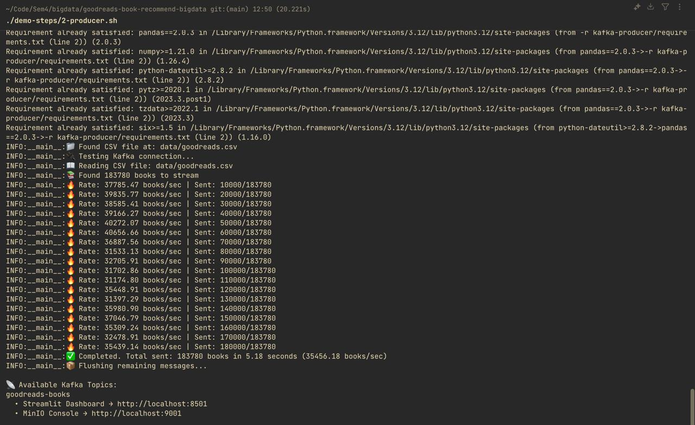
_Kafka producer berhasil streaming 183K records dengan progress tracking_

#### **2. Streamlit Dashboard**

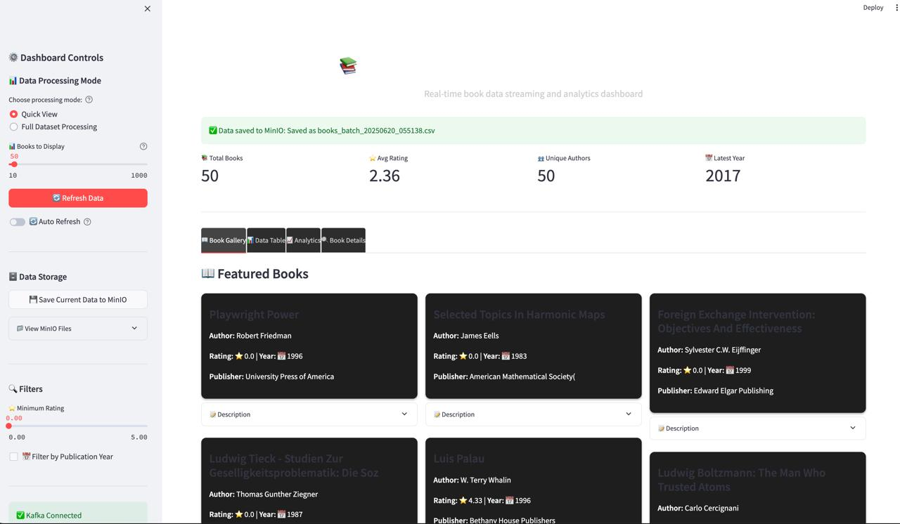
_Real-time monitoring dashboard dengan interactive filtering dan analytics_

#### **3. MinIO Storage Management**

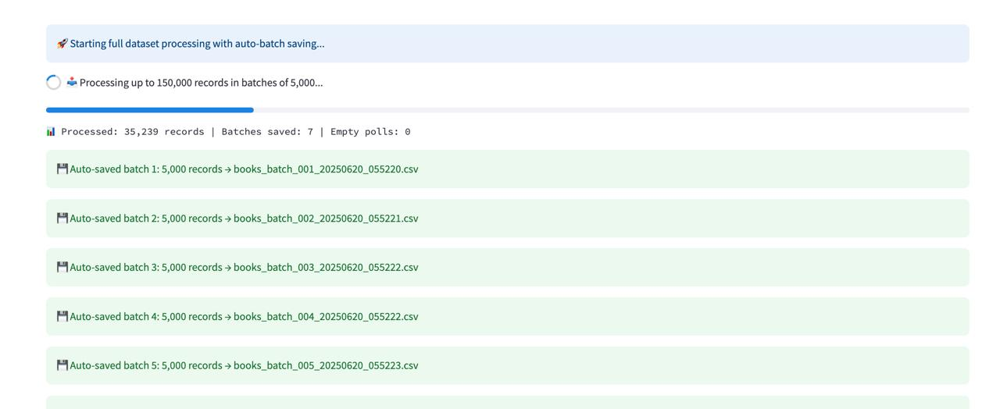
_Auto-save batch data ke MinIO storage dengan S3-compatible interface_

#### **4. Batch Data Storage**

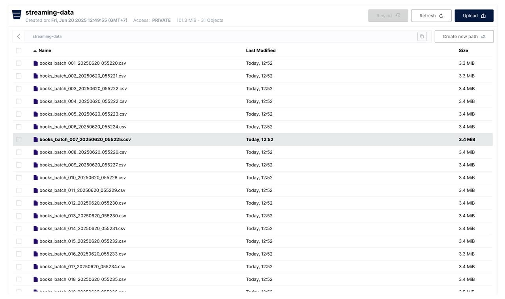
_Batch files tersimpan otomatis setiap 5K records untuk backup dan analysis_

#### **5. Spark ML Modeling**

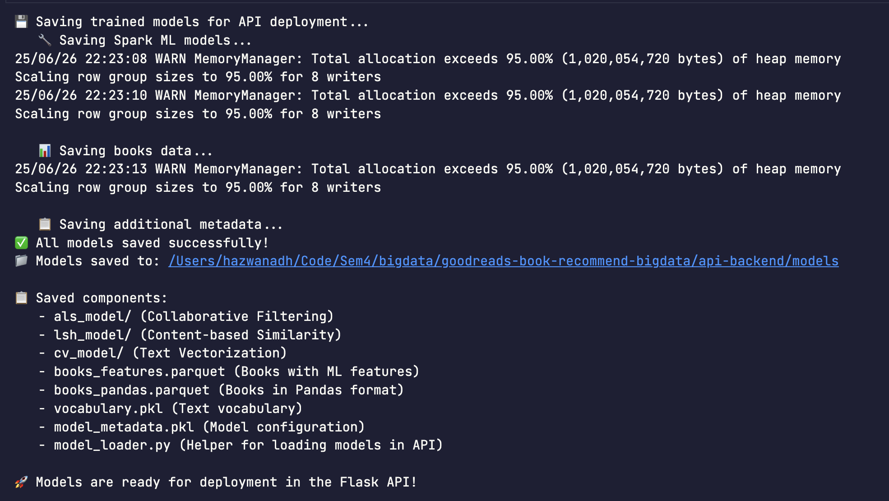
_Machine learning pipeline di Spark dengan notebook interface untuk experiment_

#### **6. Flask API Deployment**

- Deploy dan test API menggunakan `./demo-steps/3-backend.sh`
- Test health check endpoint: `curl http://localhost:5001/health`

#### **7. React Frontend Application**

- Start React frontend: `./demo-steps/4-frontend.sh`
- Akses aplikasi web di: http://localhost:3000

_Landing Page_
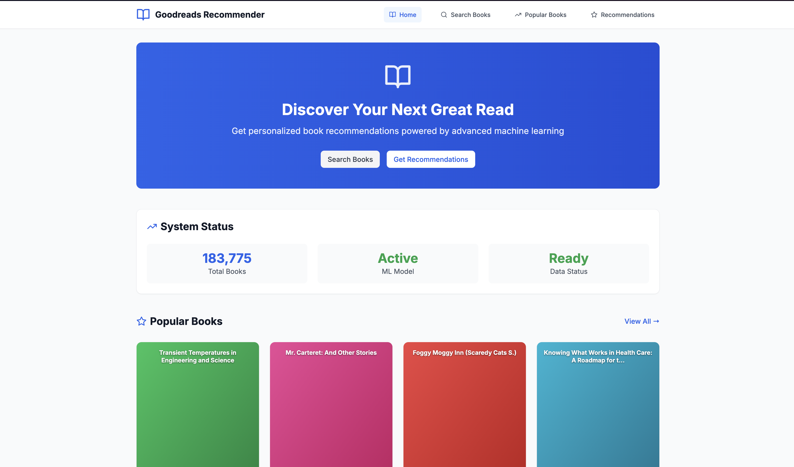
_Search Books Page_
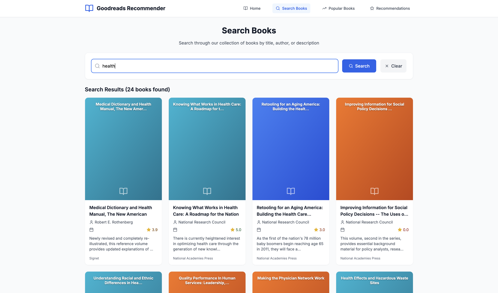
_Popular Books Page_
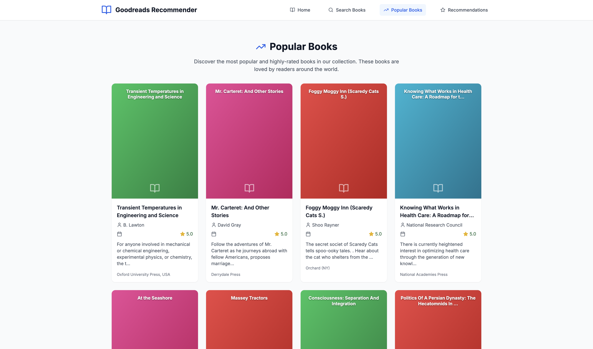
_Recommendation Page_
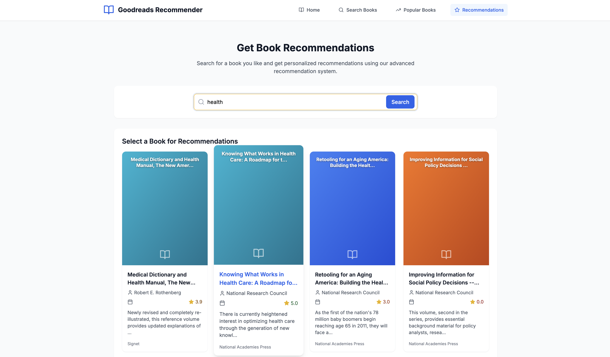
_Book Detail_
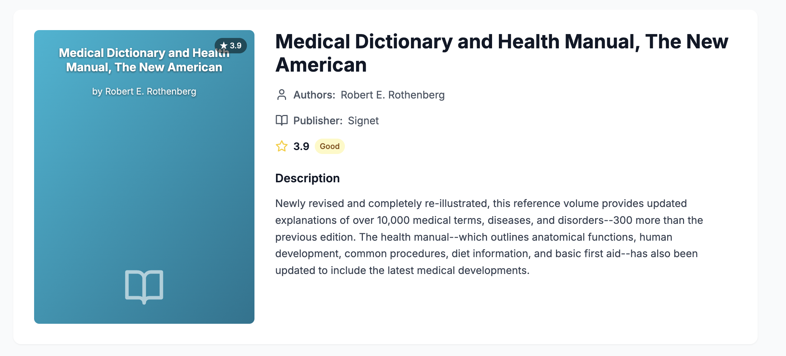
_Collaborative ALS_
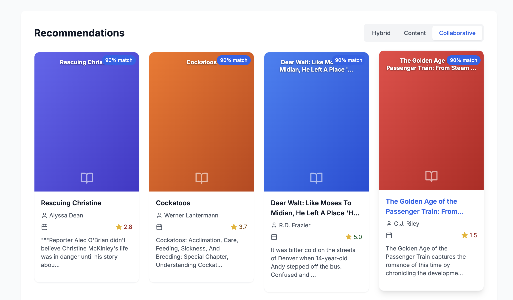
_Content-based LSH_
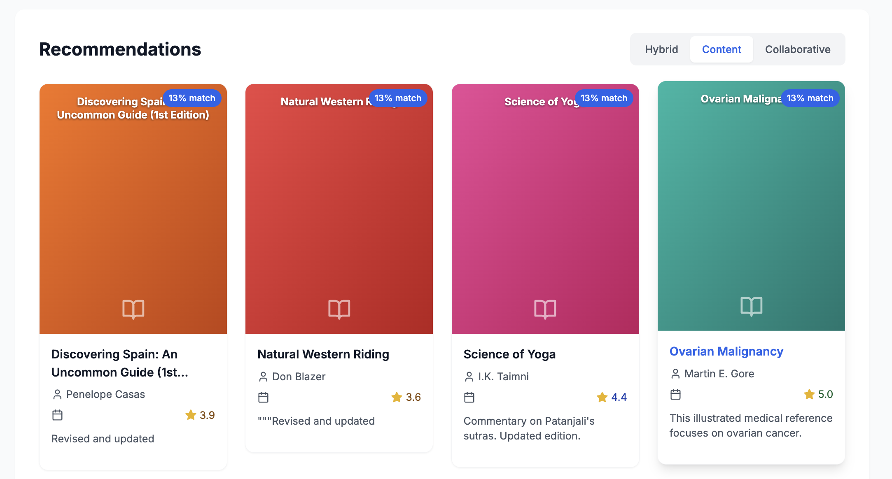
_Hybrid (Collaborative + Content-based)_
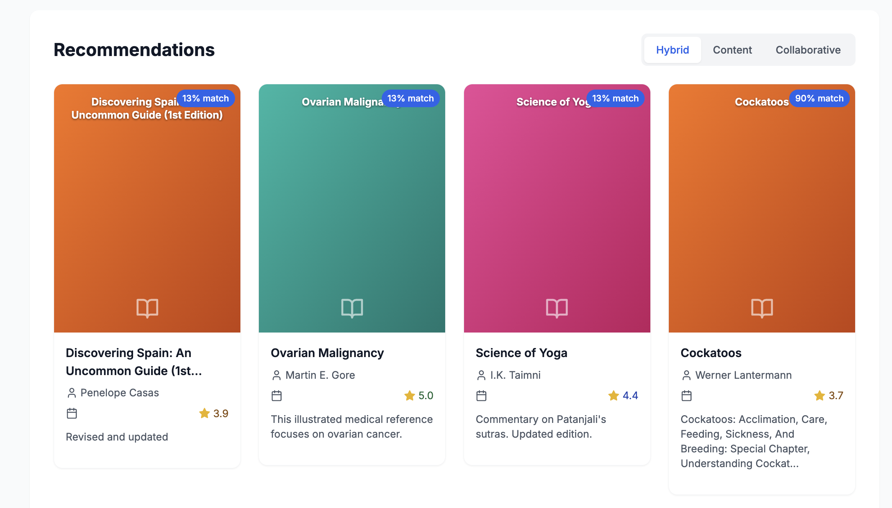

---

## 🎉 Kesimpulan

Sistem Rekomendasi Buku Goodreads ini merupakan implementasi lengkap dari arsitektur data lakehouse modern yang menggabungkan:

- **📊 Big Data Processing**: Apache Spark untuk processing 183K+ data buku
- **🌊 Real-time Streaming**: Apache Kafka untuk data ingestion
- **🤖 Machine Learning**: Hybrid recommendation (Content-based LSH + Collaborative ALS)
- **💻 Frontend**: React + TypeScript dengan UI/UX yang intuitif
- **🚀 Cloud**: Containerized dengan Docker untuk scalability
- **📈 Monitoring**: Comprehensive analytics dan monitoring

**Key Features:**

- ✅ Real-time book recommendations
- ✅ Hybrid ML algorithms (Content + Collaborative)
- ✅ Modern responsive web interface
- ✅ Scalable microservices architecture
- ✅ Production-ready deployment
- ✅ Comprehensive monitoring

**Tech Stack:**

- **Frontend**: React, TypeScript, Tailwind CSS
- **Backend**: Flask, Python, Pandas, Scikit-learn
- **Big Data**: Apache Spark, Kafka, MinIO
- **ML**: ALS Matrix Factorization, LSH Similarity
- **Infrastructure**: Docker, Nginx
- **Monitoring**: Streamlit
